# ITNSA Challenge 2021 
## Module D: Systems Troubleshooting

### Connection instructions
1) Go to https://portal.azure.com and enter your portal credentials

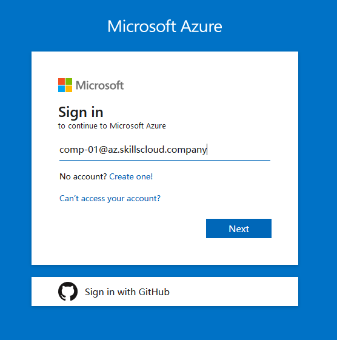 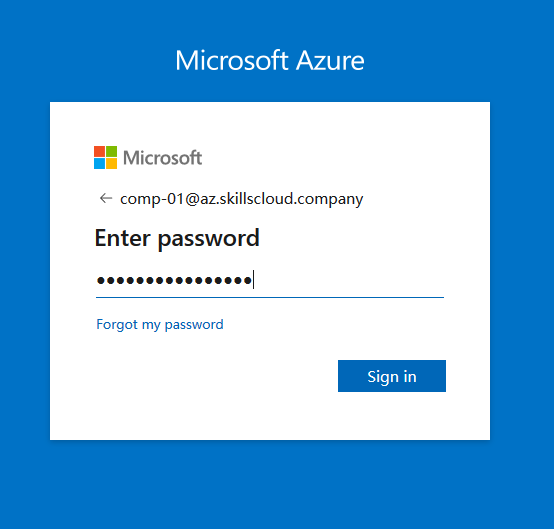

2) Choose "No" when you asked to "Stay signed in" to avoid any cookie-related problems when credentials will be rotated next time. Choose whether you want Azure to make a tour across your portal

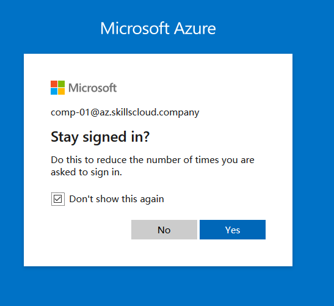 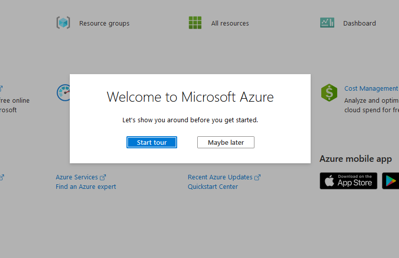

3) Navigate to "Resource groups". Notice that Azure advice small online trainings for each Azure category. Click on "Resource groups"

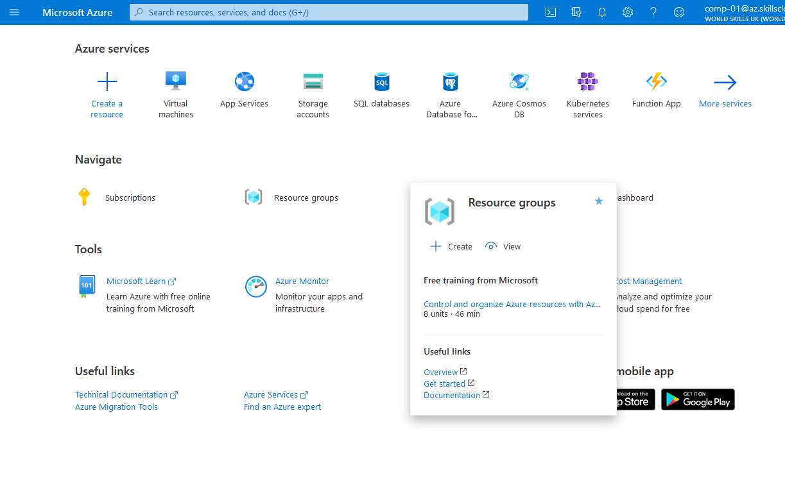

4) You will see a resource group available for your account (rg-comp-xx). Click on it.
 
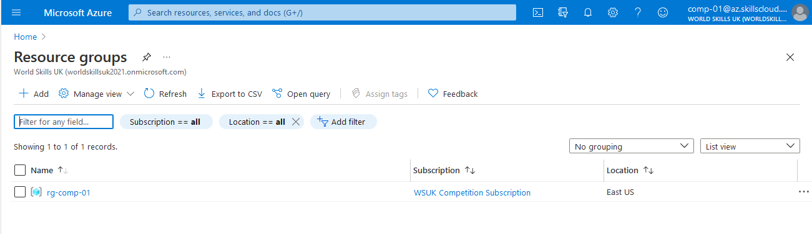

5) Now you can see a content of your resource group. To make thing easier to understand you can group items by type to see which components are related to which virtual machine.
 
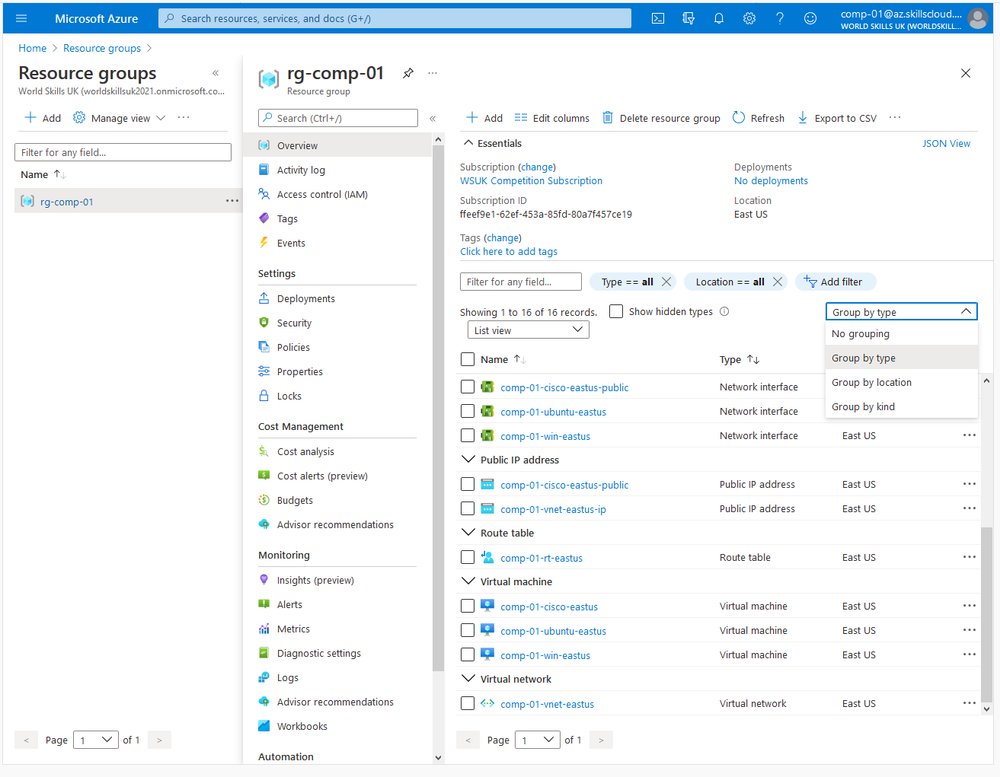
 
6) Click on comp-xx-cisco-eastus. Here you can see all information about this virtual machine as well as VM-related actions on the top. Click on "Connect" and choose "Bastion".

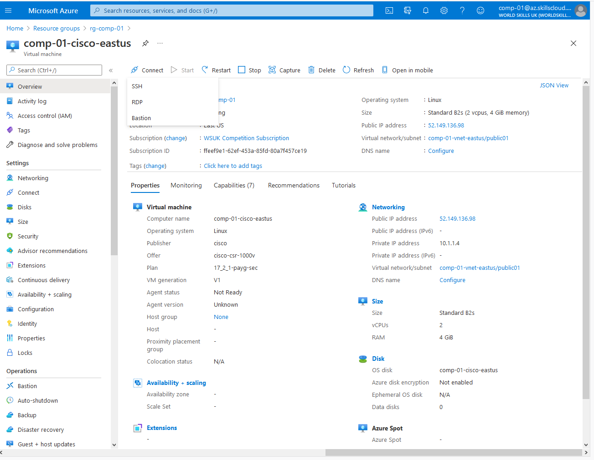

7) You will see some notification and information regarding Bastion host, click on "Use Bastion".

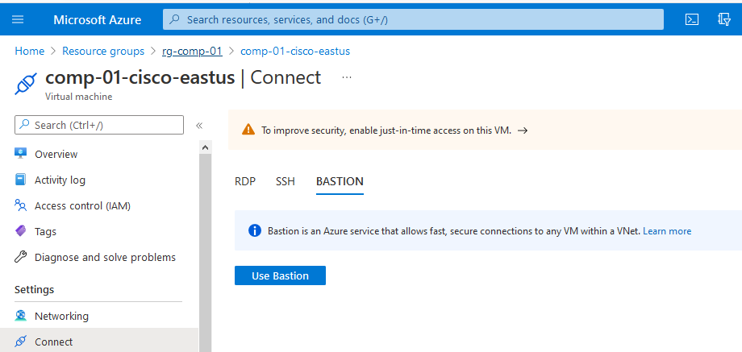

8) Enter VM credentials and click connect.

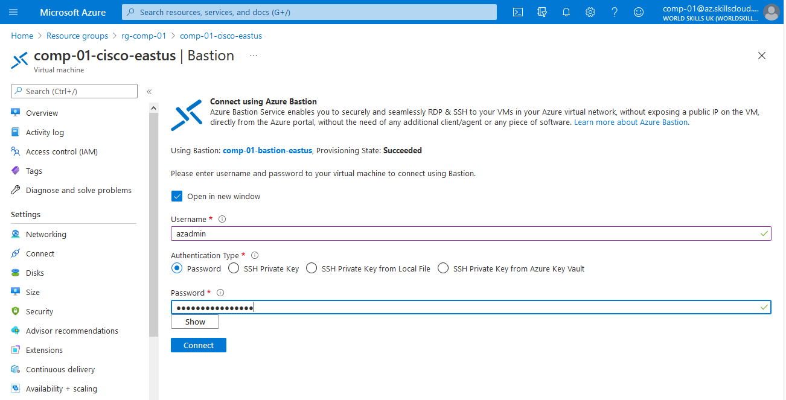

9) In case your web browser don't allow pop-up windows, allow pop-up windows for https://*.bastion.azure.com

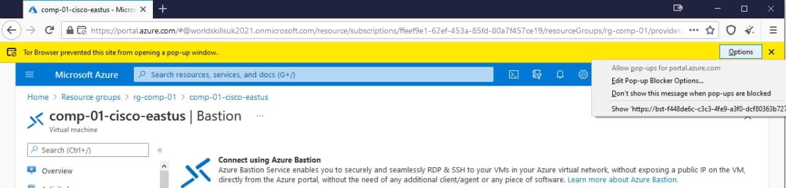

10) Bastion session will be opened in a new tab by default, and now you can access VM CLI.

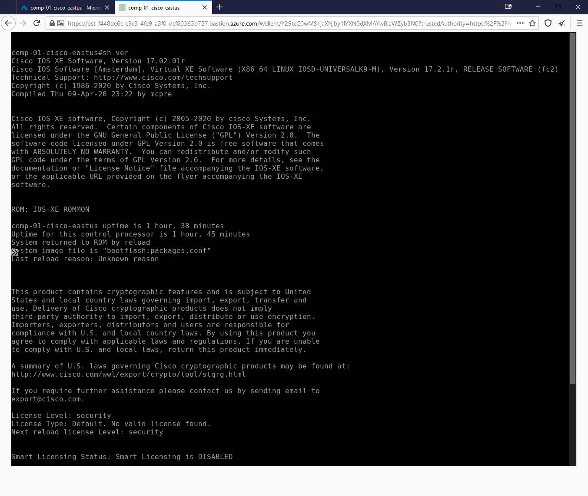

11) Notice there is a small double arrow in the middle left of the terminal. If you click on it you can access Bastion clipboard. Here you can paste anything you want to paste to the terminal.

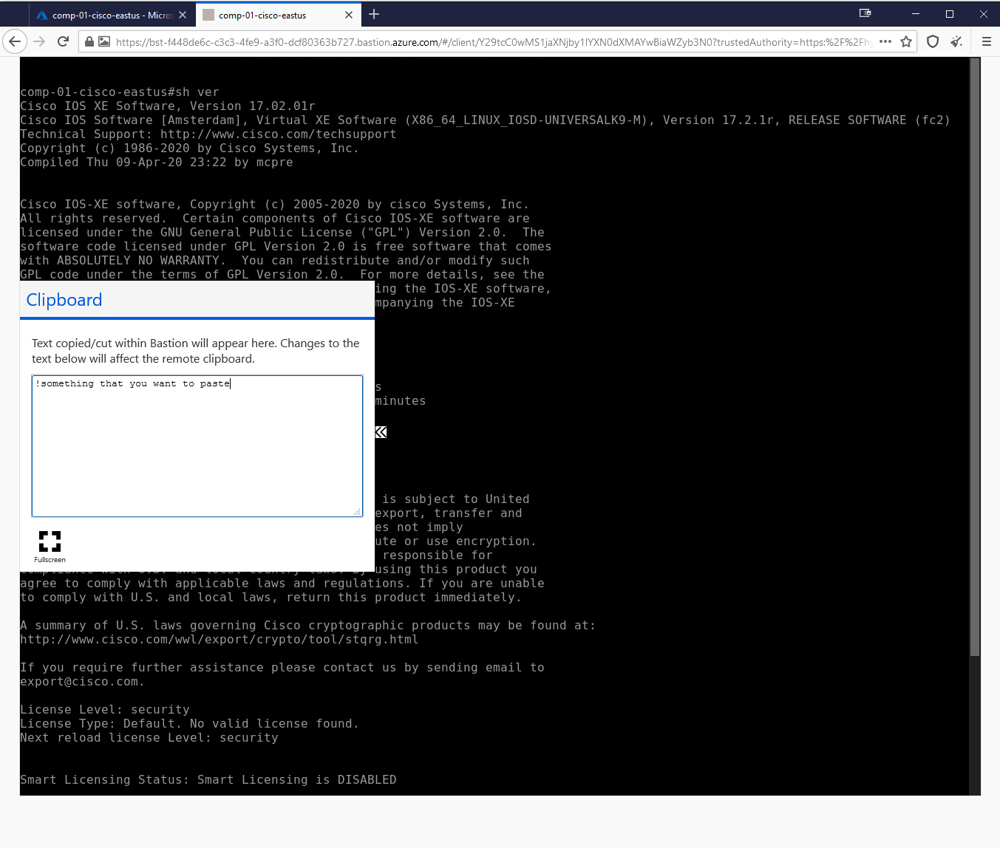

12) Once you are done, close clipboard and make right mouse click to paste contents from clipboard to the terminal

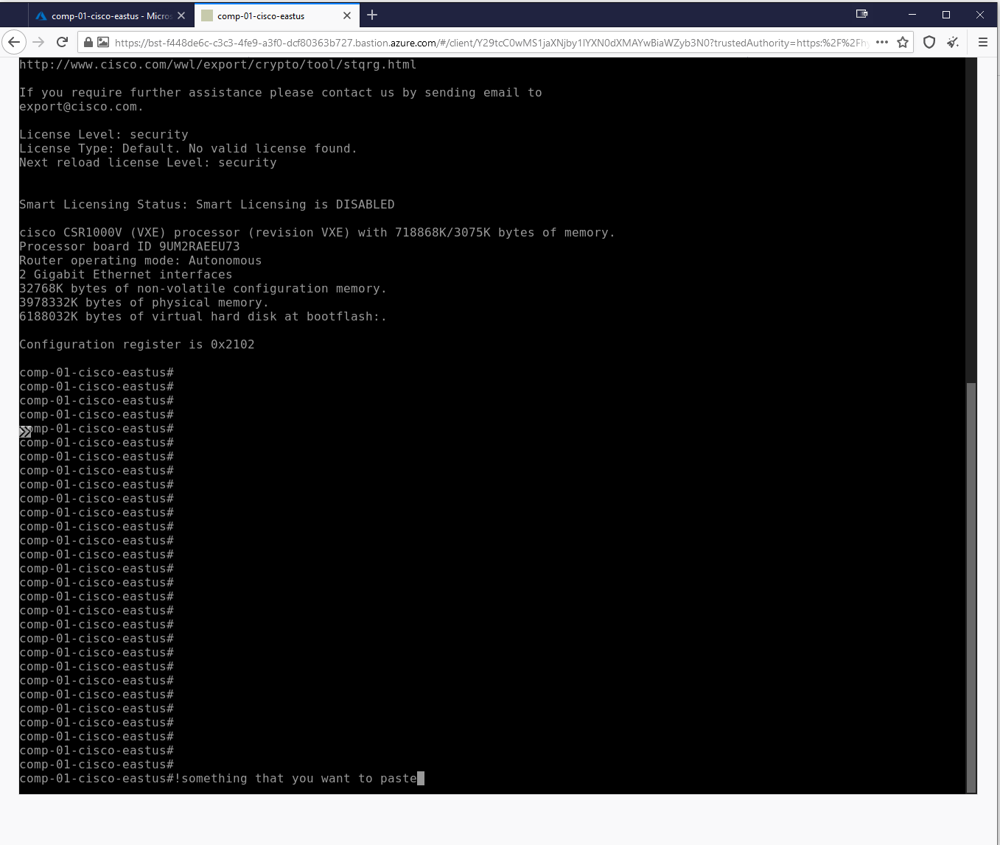

### DISCLAIMER
Azure network system controls all basic networking routines for all virtual machines. All access to virtual machines is managed via in-band connections, so if you will change\release IP address or shutdown any network interfaces, VM will loose its connection to the network and can't be reached anymore. 

### LOSING ACCESS
In case you've lost Bastion access to any virtual machine you can try to make following steps:

1) Restart bastion session (session has periodic timeout)
2) If it's a Cisco virtual machine, try to connect using any SSH client from your machine
3) If it's virtual machine behind Cisco with no direct SSH access from internet, try to connect to it from Cisco VM using SSH
4) In case SSH is not working at all, you can stop virtual machine, wait until VM status will become "Stoped (deallocated)", start VM, wait until VM status will become "Running" and try to connect using Bastion or SSH
5) If start\stop doesn't help, you can try to recover it by turning on "Boot diagnostics" option and use a serial console to bring up broken networking or SSH. 

### MARKING
- Please note that automarking will expect that all Cisco devices are available over SSH from public internet and all VMs behid Cisco devices are available over SSH from respective Cisco border devices. 
- All SSH access for automarking is expcted to work using standard port TCP/22. 
- If any VM will not be available over SSH, marking for this machine will be skipped. 
- If any Cisco VM will not be available over SSH, marking will bi skiped for this VM and for VM which is behind broken Cisco VM.
